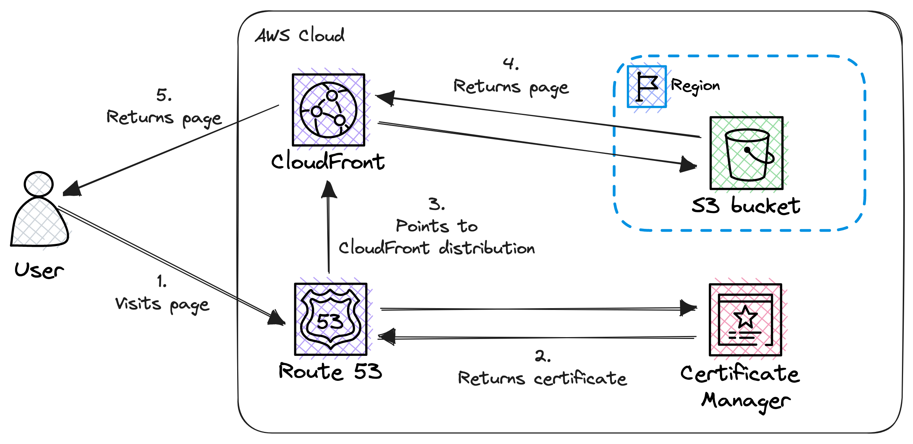
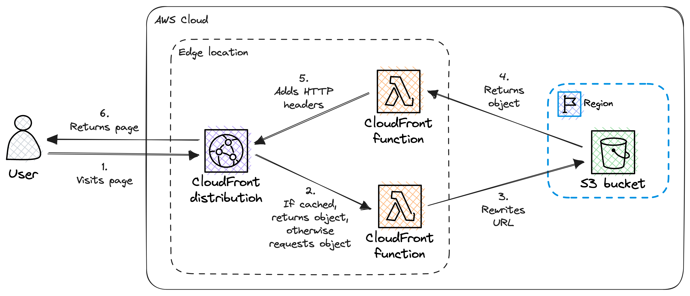

In this blog post we will discover how to implement a consitent, SEO friendly URL structure, focusing on using the **www** subdomain over the apex domain, for a personal website, using URL redirection with Amazon CloudFront and Route 53.

Before we dive deep into this topic, let's check a little bit of context:

When it comes to determining the structure of the website's primary URL, we can face several challenges, the first and most important is whether to utilize the apex domain exclusively or incorporate the **www** subdomain.

To make an informed decision, we can start searching the internet for best practices and for pros and cons. After an extensive research, we need to realize that the topic is still fiercely debated. Long story short, in the context of a small personal website, the decision ultimately boils down to personal preference. As a result, let's use the **www** subdomain in the primary URL while simultaneously ensuring accessibility via the apex domain through a seamless HTTP 301 redirect.

By adopting this approach, we strike a balance between personal preference and accommodating users who may prefer accessing the website without the **www** prefix. In this way, the website can cater to a broader range of visitors, regardless of their URL preference.

In this blog post, we will see the steps how to implement this URL structure and the insights and benefits of the chosen approach.

## Baseline architecture

Before we start the implementation, let's recap what we have.

These are the main components:

-   **Route 53**: Managing the website's domain name and pointing to our CloudFront distribution.
-   **Certificate Manager**: It is the certificate authority and issuing the SSL certificate.
-   **CloudFront**: Our Content Delivery Network (CDN).
-   **S3**: This where we store the website's content.



**CloudFront functions** play (and will play) an important role, so it worth to have a look at this diagram as well:



We utilize two functions:

-   **URL rewrite**: Modifies the viewer's request and it appends the _index.html_ to the end URL if it is not there.
-   **HTTP headers**: Changes the server's response and adds security related HTTP headers.

If you need more details, please check my previous post: [Advanced static website hosting with Amazon S3 and CloudFront](/blog/advanced-static-website-hosting-with-amazon-s3-and-cloudfront)

Unfortunately these diagrams do not tell anything about how can we access the website. For example, via **https://my-website.com** or through **https://www.my-website.com**?

This detail is hidden in the previous post, in [Step 9: Create DNS record](/blog/advanced-static-website-hosting-with-amazon-s3-and-cloudfront#step-9-create-dns-record). We created only a single **A** record which points to **https://www.my-website.com**. So the website is only reachable via the mentioned URL! Attempting to access the website via the apex domain (**https://my-website.com**) results in an error.

### What can we improve?

We made a decision and the website is only reachable through **https://www.my-website.com** and NOT via **https://my-website.com**. In this way everything is simple and easy, no SEO issues, like search engine indexing and duplicate content.

However the UX is affected negatively. Not every visitor likes to type in **www** or sometomes they simple forget to do it. This can lead to an ugly "website is not reachable" error message which is not professional and can give the impression that the website does not exist.

How can we prevent this without compromising SEO?

Canonical URLs to the rescue! 🦸

#### What is a canonical URL?

A canonical URL refers to the preferred URL for the website. It is used to indicate the original and preferred version of a page when multiple URLs point to the same content. Canonical URLs are essential for SEO and preventing duplicate content issues.

#### Using a canonical link tag

To not compromise SEO, we have to modify our website itself (or how we generate it). We need to add a link tag to the head of every page to describe the canonical URL of the page. For example:

```html
<link
    rel="canonical"
    href="https://www.my-website.com/blog/hello-world"
/>
```

#### Using HTTP redirects

We need to provide a way to reach our site without the necessity to type in the **www** prefix.

By using HTTP redirects we can easily achieve this. However we should not compromise SEO, so we need to use an HTTP 301 (**Moved Permanently**) redirect to communicate our intent clearly to search engines and ultimately to web browsers.

## Target architecture

We will not make any fundamental changes to the architecture itself. However we need to add extra responsibility to the CloudFront distribution, in particular to the function which handles visitor requests, to handle the redirect.


Now let's dive deep into the implementation details.

## Implementation

This time we do not build up the infrastructure from scratch, we will modify the existing one. As we did before, we will create and/or modify all the necessary AWS resources by using exclusively a web browser.

### Request a public wildcard SSL certificate in Certificate Manager

Please find below a step-by-step guide on how to request a wildcard SSL certificate from AWS using the Certificate Manager service:

1. Navigate to the AWS Certificate Manager service.
2. Do not forget to change the region to **us-east-1**.
3. Click on the **Request a certificate** to begin the process.
4. Select the **Request a public certificate** option.
5. Click on the **Next** button.
6. Add your fully qualified domain name, both _www.my-website.com_ and _my-website.com_.
7. Select the **DNS validation** option to validate the domain name.
8. Select the **RSA 2048** key algorithm for certificate.
9. Click on the **Request** button.
10. Depending on the validation method you selected, follow the instructions provided by AWS to complete the validation process. This may involve responding to an email or updating DNS records.

### Modify CloudFront distribution

We need to modify 2 things in our CloudFront distribution:

-   Associate the new wildcard SSL certificate
-   Enhance the viewer request handler

#### Associate the wildcard SSL certificate with the CloudFront distribution

Once the SSL certificate is issued and validated, we can associate it with our CloudFront distribution. This is how we can do it:

1. Navigate to **CloudFront / Distributions**.
2. Select the previously created distribution.
3. Go to the **General** tab.
4. Click on the **Edit** button in the **Settings** section.
5. Set the **Alternate domain name (CNAME)** to _www.my-website.com_ and to _my-website.com_. It is crucial to have both them, otherwise we will run into ugly SSL issues.
6. In the **Custom SSL certificate** dropdown select the recently issued certificate.
7. Set the **Security policy** to **TLSv1.2_2021**.
8. Click on the **Save changes** button.

#### Enhance the viewer request handler function

When the visitor checks the website via the apex domain (**https://my-website.com**) we need to redirect the visitor to **https://www.my-website.com** with an HTTP 301 status code.

This is how the modified view request handler function looks like after adding the redirection:

```javascript
function handler(event) {
    var request = event.request;

    // Redirect apex to www
    if (request.headers.host.value === 'my-website.com') {
        var response = {
            statusCode: 301,
            statusDescription: 'Moved Permanently',
            headers: {
                location: {
                    value: `https://www.my-website.com${request.uri}`
                }
            }
        };

        return response;
    }

    // Rewrite the URL
    if (request.uri.endsWith('/') === true) {
        request.uri += 'index.html';
    } else if (request.uri.includes('.') !== true) {
        request.uri += '/index.html';
    }

    return request;
}
```

The second half of the function can be familiar to us from the previous post: [Rewriting the URL](/blog/advanced-static-website-hosting-with-amazon-s3-and-cloudfront#rewriting-the-url)

### Modify Route 53 hosted zone

We have to create another **A** record for the apex domain which points to the CloudFront distribution where the redirection will take place.

1. Navigate to the **Route 53** service.
2. Select the hosted zone corresponding to the domain.
3. In the **Records** section click on the **Create record** button.
4. Leave empty the **Record name** field. This how we reference the apex domain.
5. Set the **Record type** to **A** (for IPv4).
6. In the **Alias** section, select **Yes** and choose the CloudFront distribution we have created previously from the drop-down list.
7. Leave the **Routing policy** as **Simple routing** (default).
8. Click on the **Create records** button to create the DNS record.

It may take some time for the changes to propagate, so the changes won't be visible immediatly.

After the propagation period, the website should be accessible through the apex domain: **https://my-website.com**.

### Adding canonical links

This step is heavily depends on the used framework.

At the time of writing this post, [**Gatsby**](https://www.gatsbyjs.com/) is used to generate the website's content. There is an official plugin for **Gatsby** to tackle the canonical URL problem: [gatsby-plugin-canonical-urls](https://www.gatsbyjs.com/plugins/gatsby-plugin-canonical-urls/)

This plugin adds a link tag to the head of every page to describe the canonical URL of that page.

We do not go deeper than this of the [gatsby-plugin-canonical-urls](https://www.gatsbyjs.com/plugins/gatsby-plugin-canonical-urls/) plugin usage, for that please visit its documentation page.

## Pricing

Before we apply any changes, it is wise to revisit the pricing.

What has changed in the infrastructure compared to the previous version:

-   **Certificate Manager**: New public wildcard SSL certificate
-   **CloudFront**: Modified viewer request handler function
-   **Route 53**: New **A** record

The changes are minimal, no new elements, therefor no changes in the pricing. 🤑🎉

Please check my previous post's [Pricing](/blog/advanced-static-website-hosting-with-amazon-s3-and-cloudfront#pricing) section for more details on pricing.

## Conclusion

In conclusion, we have explored a solution that allows us to dodge the "**www** or no **www**" question effectively 🤠 while preserving SEO-friendliness in the URL structure. By making a minor adjustment to our infrastructure and incorporating a small addition to our website's metadata, we have successfully catered to both the **www** and "no **www**" audiences without compromising SEO.

One of the hardest decision in this process is selecting the canonical URL and committing to it. By designating a single, authoritative URL, we establish consistency and maximize the SEO potential of our website. This decision ensures that search engines can effectively crawl and index our content, while also providing a seamless browsing experience for users.

By adopting this approach, we have not only tackled the "**www** or no **www**" conundrum but also optimized our website's visibility and performance in search engine rankings. It is essential to remember that the right URL structure is a strategic decision that aligns with specific goals and audience preferences.

## Additional resources

-   HTTP redirections
    -   [Redirections in HTTP](https://developer.mozilla.org/en-US/docs/Web/HTTP/Redirections)
-   HTTP response status codes
    -   [HTTP response status codes](https://developer.mozilla.org/en-US/docs/Web/HTTP/Status)
    -   [301 Moved Permanently](https://developer.mozilla.org/en-US/docs/Web/HTTP/Status/301)
-   Canonical URL
    -   [What is canonicalization](https://developers.google.com/search/docs/crawling-indexing/canonicalization)
-   [Choosing between www and non-www URLs](https://developer.mozilla.org/en-US/docs/Web/HTTP/Basics_of_HTTP/Choosing_between_www_and_non-www_URLs)
