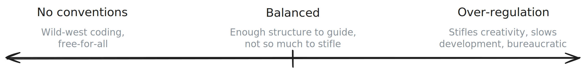
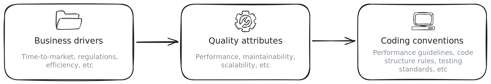
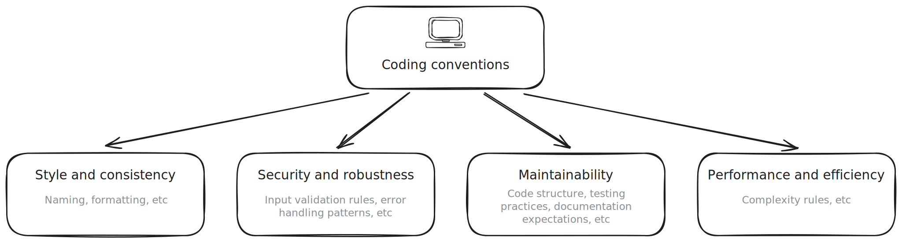
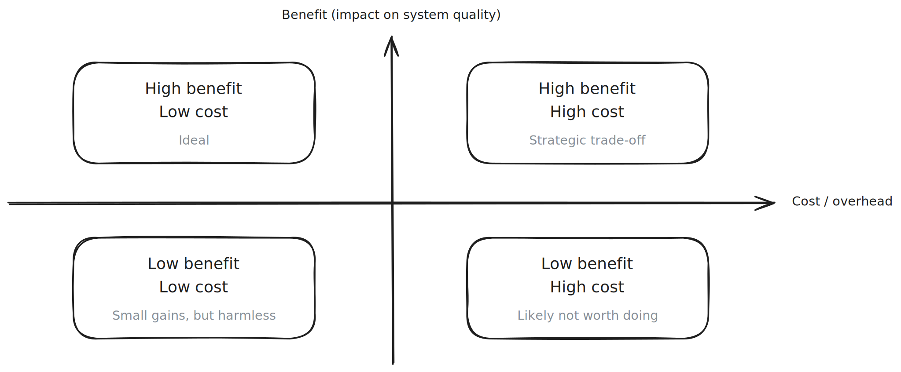
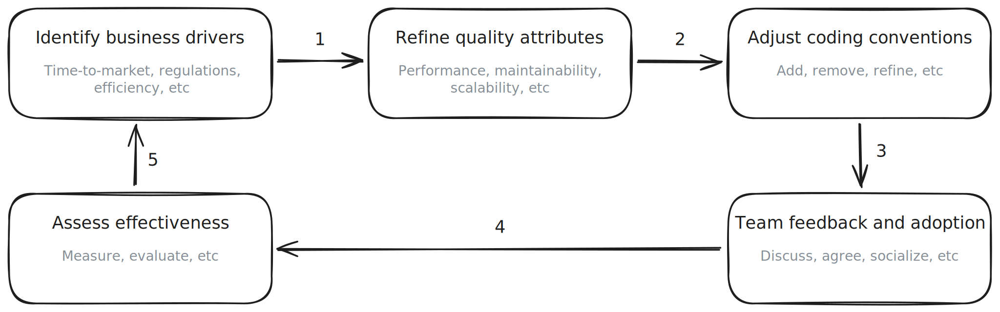

_An informal journey for software architects and tech leads on taming coding standards and aligning them with what really matters._

## The never-ending code style debate

Probably everyone is familiar with the typical code review session that spirals into a debate about where to put curly braces or whether to indent with two spaces or four. In one memorable discussion, a heated argument broke out over the **tabs vs spaces** issue - a debate so classic it even made it into a TV comedy about programmers. Everyone had an opinion, strong preferences were voiced, and yet at the end of the day, the users of the software wouldn't have noticed any difference. This scenario plays out in development teams everywhere: **coding conventions** - meant to bring consistency - sometimes devolve into **style wars**.

It is easy to get caught up in these subjective battles. After all, unlike deep architectural issues, **everyone can chime in on code style**. Psychologists and veteran developers alike have observed this as the "bikeshedding" phenomenon - trivial topics attract disproportionate discussion because they are easy to grasp. Debating code style can become a comfortable distraction from tackling harder questions. As one developer put it

> The specific formatting rules that are enforced by a formatter, and whether they make code more or less readable, is a highly subjective thing.

In other words, **many style discussions have no right answer - just different opinions**.

_Everyone has an opinion on the color of the bikeshed. In software, it's often brace style or naming conventions that draw endless discussion, while harder problems quietly lurk in the background._

We've all seen pull request comments nitpick naming or whitespace while bigger design flaws go unremarked. It's not that formatting and naming conventions don't matter - they do - but **when conventions drifting from their purpose, they risk wasting time and energy**. How many hours have teams lost agonizing over a rule that, in the grand scheme, has _little impact on the software's success_? Probably more than we would like to admit.

So how do we break out of this cycle of bikeshedding? The first step is to remember **why we have coding conventions in the first place**. Once we refocus on their true goals, it becomes easier to separate _important guidelines_ from _subjective preferences_. From there, we can redirect our efforts toward conventions that actually help us deliver better software.

## Why do we even have coding conventions?

Let's take a step back. At their core, **coding standards and conventions exist to make our software better** - not just prettier. A good set of conventions is like a team playbook: it helps everyone write code in a consistent, predictable way, which in turn improves collaboration and code quality. In fact, coding standards are typically defined as

> a set of rules and guidelines that ensure consistency, readability, maintainability, and reliability in software development.

In theory, if all developers follow these shared rules, the codebase becomes easier to understand and safer to change.

For example, think of a rule as simple as **"no magic numbers"** (i.e. use named constants instead of sprinkling raw numbers in code). This convention is not about style or aesthetics at all - it is about maintainability. A team at an e-commerce company learned this when a business rule changed: customers would now have a 1 hour window to cancel orders instead of 2 hours. Because they had enforced a "no-magic-numbers" rule, that "2" existed in one place as a constant, making the change trivial. Had the rule not been followed, that number might have been hard-coded in dozens of places, turning a quick update into a error-prone scavenger hunt. This shows how **thoughtful conventions yield tangible benefits**: consistently formatted and structured code is not just neat, but easier (and less risky) to modify.

In general, when conventions are done right, they pay off in multiple ways:

- **Readability and onboarding:** A consistent style means developers can more easily read and navigate each other's code. New team members spend less time deciphering idiosyncratic patterns. As one article notes, a codebase with unified conventions lets someone "pick up where someone else left off" more efficiently.
- **Maintainability:** Conventions like the "no-magic-numbers" example above make it safer and faster to change code. When it is time to refactor or add features, a standardized codebase provides a reliable foundation. We spend less time wrestling with inconsistent structures and more time making actual improvements.
- **Bug prevention and quality:** Many standards (error-handling patterns, input validation practices, etc) help catch bugs early. Even simple formatting conventions can prevent small mistakes (like a missing brace) from slipping through. Over time, following best practices can reduce the defect rate in a project.
- **Development speed:** It might seem counterintuitive that adding "rules" speeds things up, but it does. By avoiding common pitfalls and not reinventing the wheel on code style, teams move faster. Consistent code is easier to review and understand, which means fewer slowdowns. Teams with well-defined coding standards had faster development cycles, improving time-to-market for new features.

In short, **coding conventions serve as guardrails**. They keep the team's code aligned and clean so that the team can deliver high-quality software more efficiently. The ultimate goal is not conformity for its own sake, but to support qualities like reliability, clarity, and ease of change in the codebase.

However, here is the catch: **Not all conventions are created equal.** Some rules truly do advance these goals; others have "little technical value" and are _"more based on style and preference"_. For instance, whether we place a curly brace on a new line or the same line has no effect on the runtime performance or maintainability of the code - it is purely an aesthetic choice. Such rules might still be useful (consistency is nice), but they are not _critical_. On the other hand, a convention like "every module must have a README documenting its purpose" provides real value by aiding newcomers and knowledge sharing.

This brings us to the central issue: **when conventions drift away from their underlying purpose, they can become a bureaucratic exercise or a matter of personal taste**. Enforcing a rule that every function name must start with a verb may standardize naming, but will that effort noticeably improve maintainability or performance? Maybe, maybe not. If the rule doesn't tie back to a clear benefit, teams may follow it grudgingly or debate it endlessly.

To find the right balance, we need to ensure our conventions stay connected to what really matters for our software. To do that, we must identify those bigger-picture **"what really matters"** factors. In software architecture, we often talk about them as the system's **quality attributes** (or _"ilities"_). Let's explore what they are and why they should be the north star guiding our coding conventions.

## Quality attributes: the invisible hand behind good code

Every software system has a few critical **quality attributes** that define its success. We won't always find these attributes listed in a requirements document, but they are implicit in what the business and users expect. They include things like **performance**, **maintainability**, **scalability**, **security**, **usability**, and so on - the "-ilities" and other non-functional requirements that make the difference between a workable solution and a great one. For our discussion, we'll focus on three big ones that often come up in enterprise systems: **performance**, **maintainability**, and **scalability**. These are common areas where architects and tech leads need to make trade-offs, and where coding conventions can either support or hinder the goals.

- **Performance**: This is about **how fast** or efficient the software is under load. It is the response time of an API, the throughput of a message queue, the framerate of a video game, or the memory footprint of a background service. If performance is a key quality attribute, it means the system needs to handle a certain volume of work within tight time or resource constraints. For example, a high-frequency trading system might need to process thousands of transactions per second with minimal latency. Achieving that isn't just about picking the right algorithms at the architecture level; it trickles down to coding practices (using efficient data structures, avoiding unnecessary computations, etc). As a simple analogy, think of performance like the fuel efficiency of a car - it affects how far we can go and how fast. In code, performance-conscious conventions might include rules around complexity, memory management, or even language-specific practices.

- **Maintainability**: This is the ease with which the software can be changed, extended, and understood over time. Highly maintainable code is like a well-organized workshop: when we need to fix something or add a new part, we can quickly find what we need and understand how the pieces fit together. This attribute encompasses readability, modularity, and clarity. A maintainable system allows developers to add features or fix bugs **quickly and safely**. If we have heard the term _"technical agility"_ or _“time to market”_ in engineering contexts, maintainability is a driving factor there - the more maintainable the code, the faster the team can iterate. A great real-world example of maintainability (and its importance) comes from the realm of regulatory compliance. Imagine that the software handles user data and suddenly new privacy laws (for example GDPR) require changes in how data is stored or deleted. If the codebase is a tangled mess (spaghetti code, poor structure), adapting to these laws will be slow and painful - perhaps even "prohibitively expensive". But if the system was built with clean separation of concerns and clear documentation, implementing the required changes can be straightforward. In essence, **maintainability directly impacts how quickly we can respond to new requirements** - whether they come from the business or the outside world.

- **Scalability**: Scalability is the system's ability to **handle growth** - more users, more transactions, more data - without a drop in performance or reliability. If hundered times more people use the application next month, can it keep up? Scalability often implies architectural decisions like load balancing and distributed systems, but it also has coding-level implications. Scalable code tends to avoid hard-coded limits and doesn't assume things that won't hold true at scale (like assuming a single server can hold all users in memory). A classic scenario illustrating scalability is a Black Friday sale on an e-commerce site: if suddenly traffic spikes, a scalable system will **gracefully scale out** (add servers, increase resources) to handle the load. Code conventions that support scalability might include patterns like _"don't use static mutable state"_ (to allow horizontal scaling of stateless services) or _"prefer asynchronous processing for I/O"_ (so the system can handle more concurrent work). Essentially, if performance is about running fast in the moment, scalability is about **continuing to run fast as we grow**.

These quality attributes are often interrelated (for example scalability and performance go hand-in-hand, and maintainability can indirectly affect performance). They serve as a checklist for architects: **what does our system need to excel at to satisfy the business and the users?** Once we identify the key quality attributes for the system, we have a compass for all sorts of decisions - including how we approach coding conventions.

Here is the crux: **Coding conventions should not exist in a vacuum**. They should be one of the tools we use to achieve these quality attributes. If a convention isn't helping the system be faster, more scalable, easier to maintain (or whatever qualities are more important for us), then why enforce it? That is the uncomfortable question that needs asking when teams find themselves defending a rule purely with "well, that is our standard" and no further justification.

When coding conventions **align with quality goals**, magic happens. They stop being arbitrary rules and start being enablers of success. A team that knows _why_ a certain guideline exists (because it makes the code more secure, or because it prevents a performance pitfall, etc) will adopt it much more wholeheartedly than a rule that feels like "architecture astronaut" stuff. This alignment turns conventions into a bridge between high-level architecture concerns and day-to-day coding.

Let's make this concrete with a few examples of tying coding practices to quality attributes:

- **Performance-focused convention**: At one fintech company, low latency was critical for their trading engine (performance). The architects established a convention that no dynamic memory allocation would occur in the trading loop - everything needed for a trade was pre-allocated and pooled. This was written into the coding guidelines for that module, with clear reasoning. Developers followed it because they understood that a seemingly harmless `new` or `malloc` in the wrong place could introduce a jitter or GC pause that might lose millions. The convention was directly serving a performance goal, not just someone's personal taste.

- **Maintainability-focused convention**: A SaaS product team prioritized rapid feature development (time-to-market was crucial), so maintainability was king. Their coding standards emphasized clear organization: one of their conventions was that **every module or feature area must have an accompanying README or at least clear comments explaining its API and quirks**. This wasn't just bureaucratic overhead - it was there to ensure that when Developer X had to modify code written by Developer Z six months ago, they could quickly get up to speed. They also had rules like "functions should ideally be < 50 lines" and a strong preference for self-documenting code over excessive comments. The team found that following these practices meant new features could be added in days instead of weeks, because the code was easy to work with. Here the coding conventions supported maintainability, which supported the business need for agility.

- **Scalability-focused convention**: In a cloud microservices project, scalability (and resiliency) was a top concern from day one. The architects knew that if usage grew, they would need to run multiple instances of each service. They ingrained a simple convention: **no static in-memory caches**; use the distributed cache service instead. Also, **no writing to local disk** for persistent data; use the shared storage service. These rules ensured that when they scaled out services, one instance wouldn't hold important data that others didn't have. It seems obvious, but by making it a part of the code review checklist and documented standards, they caught a few instances where a developer might have, say, used a static `Dictionary` to cache some reference data. Thanks to the convention, they replaced it with an approved pattern. This way, the codebase was always aligned with the scalability requirement - no single-server assumptions hiding in the code.

In all these cases, notice that **the convention wasn't random** - it was a response to a known goal or risk. This is the essence of aligning conventions with quality attributes: start with the question _"what does our software need to do really well?"_, and then shape the coding guidelines to facilitate that.

But where do these quality priorities come from? Why care about maintainability more in one project and performance more in another? That brings us to the driving force behind it all - the **business drivers**.

## From business drivers to "-ilities": connecting the dots

If quality attributes are the _technical_ qualities we need, **business drivers** are the _why_ behind them. They are the context - the business goals, constraints, and environment - that make certain quality attributes matter more than others. As architects, we can't decide to optimize for everything (in fact, trying to maximize all quality attributes is a sure recipe for analysis paralysis and over-engineering). Instead, we look at what the business is trying to achieve and select architectural priorities accordingly.

Let's break down a few common business drivers and see how they influence the emphasis on performance, maintainability, or scalability (or other attributes):

- **Time-to-market and competitive pressure**: If the business is in a fast-moving market, getting new features out quickly is a top priority. This often means **maintainability (or modifiability)** of the code is critical. The business driver ("we need to beat competitors to market with new capabilities") trickles down to a quality attribute ("the system must be easy and fast to change"). In turn, coding conventions should support that by favoring simplicity and clarity over micro-optimizations. For instance, in such environments we might relax or automate trivial style rules (let a tool auto-format the code) so that developers can focus on higher-level design. We would emphasize conventions that prevent spaghetti code - like consistent architecture patterns, layering, and good naming - because those make the codebase shapable. A side effect of fast iteration is sometimes technical debt, so another convention might be to document _"TODOs"_ or use feature toggles in a consistent way to manage incomplete features without derailing the main branch. The key point is that **speed of development** as a business goal leads to conventions that streamline the development process. It is no surprise that many agile teams adopt very strict coding standards for things like unit testing, continuous integration, and definition of done - these ensure that the software remains shippable at any time, aligning with business demands for agility.

- **Evolving regulatory and compliance environment**: Consider a business in a regulated industry (finance, healthcare, etc) where laws and regulations can force changes to the software. The business driver here is **compliance** - the cost of not adapting to new rules is legal trouble or lost market access. This driver again points to **maintainability and flexibility** as key attributes: the system should be easy to update in response to external changes. But it might also introduce needs for **auditability and correctness**. Coding conventions in such contexts often include things like _"always use established libraries for crypto and logging"_ (to meet security and audit requirements) or _"follow a strict code review process for data privacy related code"_. One very real example: after GDPR went into effect, teams that had consistently tagged and isolated personal data in their code (using conventions for naming or structuring such data flows) found it easier to implement the "right to be forgotten" features. Those that had personal data spread all over with no clear convention, had a nightmare on their hands. A convention as simple as "all functions that persist user data must go through module X and be reviewed for compliance" can be gold in such environments. In short, the business driver of compliance reinforces the importance of maintainable (and well-structured) code, because when the law changes, we don't want to be digging through spaghetti. Recall the earlier example: a new privacy law forced a change, and the team with a well-architected, documented system adapted easily, whereas a legacy tangle would have struggled.

- **Operational efficiency and cost management**: Businesses often care about **doing more with less** - handling growth without proportional growth in cost. This driver relates directly to **performance and scalability**. If each server can handle twice the load, we need half the infrastructure (saving costs); if the software can scale out easily on cheap hardware, we can avoid expensive big-iron solutions. A classic business case is an online service trying to minimize cloud expenses - every CPU cycle and GB of RAM translates to money. Thus, the business driver (cost efficiency) maps to a quality attribute (performance efficiency). Coding conventions that support this might include guidelines for writing efficient code: for example, "favor streaming processing of large data sets to reduce memory usage", or "use bulk operations for database access instead of one-by-one writes". It might also include rules like "no debugging logs in hot code paths in production" to avoid unnecessary I/O overhead. In a more extreme case, if using a garbage-collected language, a team might establish conventions to reduce garbage generation (string pooling, object reuse patterns) because high throughput with low latency might demand it. On the scalability side, if the business anticipates rapid growth, architects may push for conventions around writing horizontally scalable code (like the earlier microservices example). They may even introduce **design guidelines as part of coding standards** - for example, a rule that "features must be designed as independently deployable services if they are domain-complete" to ensure the system can scale in chunks. While those are more architecture decisions, encoding them in conventions helps developers implement the architecture correctly. Ultimately, the business wants a system that can grow without pain, so the coding conventions should encourage developers to write code that can **expand and perform under pressure**.

In all these cases, we see a chain from **business needs -> quality attributes -> coding conventions**. An effective architect always keeps this chain in mind. If tomorrow the business priorities shift, the areas of code quality we emphasize might also need to shift, and so might our standards. For instance, a startup might start favoring time-to-market over everything (so maintainability, simplicity first). Later, as the user base grows, performance and scalability might take center stage, and the team might add more performance-oriented coding guidelines (or even reconsider earlier shortcuts that now hinder performance).

It is also worth noting that a **coding convention disconnected from any business or quality concern is probably ripe for questioning**. That doesn't mean every single line in the style guide must have a deep rationale - some things truly are just convention for consistency's sake - but if developers start grumbling "why do we do this weird thing, it doesn't seem to matter", it is a sign to evaluate that rule. Maybe it _does_ matter and we need to communicate the reason better, or maybe it indeed is a relic that can be dropped. A living example is the evolution of coding standards in many open source projects: they often start very strict on minor stylistic choices, but over time, they have adjusted rules that proved too cumbersome or not beneficial. Wise architects and leads periodically **review their coding standards** for this reason - to ensure each rule earns its keep. If it is not helping readability, not preventing bugs, and not aligning with any quality target, maybe it is just a personal preference masquerading as law.

## Aligning conventions with what matters and letting go of what doesn't

By now, we've established that the **best coding conventions are those aligned with key quality attributes**, which in turn stem from business drivers. So how do we put this into practice? How does a team actually go about crafting or evolving their conventions with this alignment in mind?

First, it starts with **awareness and communication**. As an architect or tech lead, we need to articulate to the team _what the goals are_. It is surprising how often developers aren't aware of the rationale behind a project's guidelines. If the priority is, let's say, **scalability and resilience**, we should tell the team that outright. Then we tie it to concrete expectations: for example, "We expect to handle 10 times more traffic in the next year, so we're emphasizing conventions that help us build safe concurrent code and horizontally scalable services". When people understand the _why_, they're far more likely to buy into the _what_. As one expert noted, **architectural leadership requires effectively communicating the "big picture" to the team**, not in one grand lecture but through continuous dialogue. We need to make that big picture - those quality goals - a recurring theme in discussions, design reviews, and yes, in coding standard documents.

Next, we need to **examine the existing coding standards (if we have them) or create new ones, by evaluating each potential rule against the quality attributes**. This can be a collaborative process. A good exercise is to take each major section of a coding standard and ask "what value does this bring?" For example, if we have a rule "All public APIs must have detailed Javadoc comments", link it to maintainability (it aids future developers and integrators - a maintainability concern). If we have "Use immutable data structures wherever possible", perhaps that's linked to reliability and safe concurrency (and performance in some cases). We might discover some rules that don't have a strong justification. This doesn't automatically mean they should be tossed, but it's a sign that we should at least clarify them or consider de-emphasizing them.

On the flip side, we might notice gaps: perhaps we have no conventions at all related to performance, but we realize performance is mission-critical. That could mean introducing some guidelines - for instance, a section on algorithmic complexity, or a checklist for memory-intensive code. For a real-world example, one development blog emphasizes that

> No coding convention should be implemented arbitrarily. Ideally, they should align with the broader objectives of a company or even a specific project. For instance, if your project aims for high performance, adopting conventions that reduce code complexity could be a priority.

This is sage advice: start from objectives, derive conventions from there.

It can be helpful to categorize conventions by their purpose:

- **Style and consistency**: (mostly to aid readability - for example, naming, formatting). Automate these where possible, so they don't occupy human brainpower. Modern linters and formatters can enforce most style rules, freeing the team from arguing about them. As an architect, we might decree: "We will use a formatter for JavaScript (let's say `Prettier`) with our agreed settings, and we won't debate those in code reviews". This removes a huge source of bikeshedding. The code stays consistent, and the team's energy is saved for more important discussions.

- **Security and robustness**: (if relevant to the domain - for example, input validation rules, error handling patterns, avoiding certain functions that are insecure). These align with attributes like security, reliability, and even maintainability (because robust code is easier to maintain than fragile code). If the business has heavy security needs, the coding standards might include things like "always use parameterized queries (to prevent SQL injection)" or "no using `eval()` in JavaScript", etc. These definitely have clear rationale - we need to make sure everyone knows it.

- **Code health and maintainability**: (to keep the code easy to work with - for example, maximum function length, module decomposition guidelines, testing practices, documentation expectations). These should be strongly justified with maintainability goals. Perhaps we enforce a rule that every bug fix must come with a unit test. That's a convention ensuring reliability and long-term quality. Or we might have a convention of using dependency injection over hard-coding new instances, to allow easier testing and swapping of components (maintainability / design flexibility).

- **Performance and efficiency**: (to meet performance / scalability goals). These might be more project-specific. A game development team might have a rule to always prefer bitwise operations for flags (for speed), whereas a enterprise app team might ban using `SELECT *` in SQL queries (for efficiency). Tuning these conventions requires measuring their impact - we don't want to prematurely optimize, but we do want to set obvious guardrails against known performance killers. Profiling and past incidents can guide what rules matter.

By explicitly linking each section of the standards to a goal, we create a **"line of sight" from the developer's IDE to the company's objectives**. For example, a comment in the code standard might read: "**Why:** We enforce X convention _because_ it helps with Y (quality attribute), which is important given our context of Z (business driver)". We don't have to do this for every single rule (it would be overkill to explain why 4-space indentation helps - that one is just for consistency). But we need to do it for anything that could be questioned. This not only educates, it also helps newcomers understand the culture and priorities of the team.

Another important aspect is **prioritization and degree of enforcement**. Not every convention is a hill to die on. Make it clear which ones are critical (usually the ones tied to critical quality attributes) and which ones are more guidelines or preferences. A common approach is to mark rules as "Must", "Should", or "Consider" in a coding standard. For instance: _"Must: All HTTP endpoints must log requests and responses at DEBUG level. Should: Log messages should be structured (to aid parsing). Consider: Using correlation IDs for cross-service tracing."_ This grading helps tech leads and reviewers know when to push back and when to be flexible. As one coding standards guide wisely points out

> In the real world, standards are important but maybe following all of the standards just isn't time or cost-effective. Maybe there is very little uptake in the development community for the standards, so using them really doesn't achieve much. Maybe the standards are unclear and conflicting. All of these factors could have an impact on whether or not standards should be enforced.

By explicitly prioritizing, we ensure that the **truly important conventions (the ones with quality impact) are never skipped**, while the lower-level ones can bend if needed without undermining the software.

Now, let's address the human element: **getting buy-in**. The best conventions won't help if the team doesn't follow them. People resist rules that feel imposed or arbitrary, but they generally embrace practices that make their job easier or their product better (especially engineers, who tend to be rational when presented with evidence). Involving the team in establishing and evolving the conventions is crucial. As an architect or lead, we set the vision (quality goals) and we can propose guidelines, but invite discussion. Maybe hosting a workshop: "Our main goal is to improve our app's scalability; what patterns or practices should we adopt or avoid in code to support that?" Developers will bring up things that matter on the ground. Perhaps someone notices a lot of latency due to inefficient parsing - they might suggest a convention of using a faster library for that hot path. This bottom-up input is invaluable. It not only produces better rules, it gives the team ownership. When developers help craft a rule, it is **no longer just a rule - it is our agreed best practice**.

During these discussions, we should keep tying things back to outcomes. It steers debate away from "I like this" / "I don't like that" toward "This will help us achieve X". For example, two developers might disagree on an error-handling style. Instead of a stalemate, we need frame it as: "which approach best supports our system's reliability and maintainability?" Perhaps one style leads to clearer logs (helpful in operations), so it wins on that merit. Or maybe the difference is purely aesthetic - then it truly doesn't matter, and we can let team preference or a simple majority decide and move on. It is about being _reasoned_ rather than arbitrary.

One more tip: **use automation and tools as an advantage**. We hinted at this but it is worth elaborating. Tools can enforce the boring parts of conventions, ensuring consistency without draining human effort. Linters will catch a lot of errors and style issues; formatters will fix whitespace and commas. They need to be used as a first pass. Continuous integration can run static analysis to ensure certain rules (like complexity thresholds or forbidden APIs) aren't violated. There are even specialized linters for certain quality concerns - for example, security linters that flag risky functions. By letting tools police the mechanical aspects, the team's code reviews can focus on the higher-level aspects: "is this code clear?", "Does it meet the performance guidelines?", "Is it following the architectural pattern?". Those are things a human reviewer is great at, especially when they understand the context. When an automated system flags a deviation (say someone used a disallowed function), it's not personal - it's just the process. This reduces friction. It also reinforces that **the conventions are real and enforced**, not just suggestions that can be ignored. When everyone knows that, for example, any code not meeting the style guide won't pass the CI pipeline, they'll quickly adapt and internalize the standards.

## Bridging the gap: architects and tech leads as communicators

Let's zoom out and consider the roles of the **software architect** and **technical lead** in all of this. One might wonder, isn't defining coding standards more of a lead developer or team lead job? Where does the architect come in? In many organizations, architects operate at a higher level of abstraction - dealing with system components, integration, high-level design. But the truly effective architects don't stop there: they **bridge the gap between abstract architecture principles and concrete coding practices**.

Think of the architect as the person who holds the map of those business drivers and quality attributes we talked about. They understand why performance is critical, or why regulatory flexibility is needed. The tech leads are the boots on the ground ensuring that day-to-day development aligns with that map. For coding conventions to work, the architect must **communicate the intent** behind them to the tech leads, who in turn socialize it with the rest of the development team. It is a cascade of communication: from business to architect to tech lead to developers - and back up when there is feedback.

An architect can't (and shouldn't) micromanage how every line of code is written - that would defeat the purpose of having skilled developers. Instead, the architect sets the direction (for example, "We value maintainable code because we have to move fast and can't afford delays in adding features") and maybe helps drafting the initial set of standards reflecting that. Then the architect works with tech leads to refine these guidelines and resolve any conflicts with real-world constraints. Crucially, architects should also be open to feedback: maybe a certain convention sounded good in theory but in practice is slowing the team down or causing confusion. Tech leads act as the eyes and ears here, bringing that information back so the standards can evolve. A healthy loop of feedback ensures the conventions stay effective and relevant.

One of the architect's less glamorous but most important duties is **evangelism** - continuously reminding and explaining to the team _why_ certain practices matter. As noted in an article on architecture,

> The architectural direction must be reiterated throughout the effort. It is all too easy to get caught up in the heat of delivery and lose sight of the overall goal. Having an architect that is continuously engaged will help maintain a consistent vision.

This is spot on. In the rush of a deadline, a developer might be tempted to take a shortcut that violates a convention ("I will just hardcode this to get it done"). If the team has a culture of understanding the bigger picture, someone - a tech lead or the architect - will catch that and say, "We can't do that because it undermines our scalability goal; let's find a proper solution within our guidelines". Over time, developers start to self-police with the big picture in mind.

Architects can reinforce this by **leading by example** too. While an architect might not code the core features daily, when they do write code, if they follow the standards diligently, it sends a strong message. It shows that the conventions are not arbitrary rules for others, but something everyone - even the high-level architects - cares about and uses. Some architects conduct periodic code reviews focusing specifically on architectural concerns (which include those quality-related conventions). It's an opportunity to praise good adherence ("Great job refactoring that - it improves maintainability just as we need for quick releases!"") or to guide where things slip.

Additionally, architects and tech leads should work together to **educate new hires or teams** about these standards in the context of system goals. Instead of handing a newcomer a dry document of rules, explain to them: _"We have this coding standard because our product is a regulated medical device, so every piece of code has to be extremely robust and traceable. Here's how our conventions help achieve that..."_ When people hear that, the rules transform from pedantic checklist to a mission that they are part of.

In many ways, this is about building a culture. A culture where **code quality is seen not as a checkbox, but as integral to delivering business value**, in such a culture, coding conventions aren't resented; they are respected as tools that help the team succeed. And culture, as we know, is shaped heavily by leadership. The architect and tech leads collectively are that leadership for the technical team. It's their responsibility to curate the conventions, align them with evolving business needs, prune them when they become hindrances, and constantly connect the dots for everyone else.

Before we conclude, let's address a potential misconception: aligning coding conventions with business-driven quality attributes does **not** mean that everything becomes heavy or overly serious. One might worry that this approach takes the fun out of coding or the elegance out of code style. On the contrary, when developers understand the context, they often find it _more_ satisfying to code within those guidelines. It's empowering to know that the clean code isn't just about appeasing a style cop - it's making the product better in ways users will feel, or it's preventing future teammates from pain. It gives purpose to what could otherwise feel like arbitrary rules.

Also, balanced doesn't mean boring. We can still have an expressive coding style and creativity within the bounds of conventions that matter. It's just that the creativity will channel into solving real problems (like how to design a module for scalability) rather than inventing a quirky personal style that no one else understands.

## Conclusion

As we wrap up this narrative, let's circle back to the initial conundrum: finding the right balance in defining coding conventions. It should be clear now that the "right balance" isn't some fixed formula - it's about **context and alignment**. Coding conventions exist to serve the software, and the software exists to serve the business (and users). Therefore, the best conventions _serve the business_, even if indirectly, by enhancing the qualities that matter in the software.

If we boil it down to one core insight, it's this: **every coding convention we adopt should either support a key quality attribute of the system or at least not impede it.** If a rule doesn't trace to performance, maintainability, scalability, security, or whatever critical qualities the team cares about - then its value is suspect. It might just be a subjective preference. And while there's nothing wrong with a little subjective preference (we all like code to look nice), those are the conventions to de-prioritize and **handle with automation** or lightweight process. They are not worth lengthy debates or zealous enforcement.

On the other hand, conventions that do support the system's quality goals should be **championed, clearly explained, and consistently enforced**. They are the team's collective wisdom put into practice. They help prevent the kinds of issues that keep architects up at night: the slow creep of technical debt, the unforeseen scalability bottleneck, the costly bug in production. By aligning coding practices with these concerns, we create a virtuous cycle where doing the right thing architecturally is the path of least resistance for every developer.

For software architects and tech leads, the journey doesn't end once we document a shiny new coding standard that checks all these boxes. It continues as the system evolves and as new challenges arise. Business drivers will change - maybe a startup finds product-market fit and now has to scale rapidly (hello scalability conventions!), or new regulations come in (time to double down on maintainability and perhaps add security standards). A good leader keeps the coding conventions in sync with these changing needs, **avoiding the trap of letting the style guide become a stagnant relic**. In other words, we need to treat the conventions as living artifacts that grow with the codebase and business.

In practical terms, we should remember to review and iterate. Solicit feedback: "Are there pain points in following the standards?", "Are certain rules constantly ignored (maybe indicating they don't make sense or need better tooling)?", "Is there a new type of bug or issue cropping up that suggests a need for a new guideline?". We need to use retrospectives or post-mortems of incidents to refine the conventions. For example, if a performance outage happened because a developer wrote an inefficient query, that is a lesson - perhaps the standards need an entry about query patterns or the team needs training. By doing this, we ensure the conventions remain **effective and respected**, rather than something people roll their eyes at.

In summary, **coding conventions should be a means to an end, not an end in themselves**. The ultimate end is a successful software project: one that meets its performance goals, can be evolved quickly to meet new needs, and can grow to support more users - all in alignment with what the business is trying to achieve. When we find the sweet spot where the team's coding conventions clearly support those ends, we will notice the nature of conversations changing. Code review discussions shift from "nit: please add a space here" to "hey, following our guideline, should we refactor this method to make it more modular for future changes?" Developers start using the language of architectural goals: _"I used this approach to improve maintainability, as per our standards."_ That is when we know the balance is right - the team isn't arguing style for style's sake; they are focused on **style with substance**.

So the next time we find ourselves in a debate about a coding standard, we need to ask this: **Which of our key quality goals does this support?** If there is a good answer, we should state it, and we have to make sure everyone understands it, and the debate will likely resolve in favor of whatever choice best serves that goal. If there is no good answer, well, maybe it is not worth more debate - flip a coin, use the tool's default, or let the team decide and move on. By keeping our eyes on the bigger picture, we can escape the gravity of bikeshedding and elevate our coding conventions to truly support the system's success.

In the end, **great software architecture is as much about communication and shared understanding as it is about technical design**. Coding conventions are one of the touchpoints where that understanding is put into practice every day with each commit. Get them aligned with what truly matters, and we will find that they become a powerful ally - not a necessary evil - in the quest to build quality software. And maybe, just maybe, we will spend a little less time arguing about semicolons and a little more time celebrating a system that is performant, robust, and ready for whatever the future throws at it.

## Used resources

- [Procrastination and the Bikeshed Effect](https://blog.codinghorror.com/procrastination-and-the-bikeshed-effect/)
- [Why Should I Care What Color the Bikeshed Is?](https://bikeshed.com/)
- [Don't Let Architecture Astronauts Scare You](https://www.joelonsoftware.com/2001/04/21/dont-let-architecture-astronauts-scare-you/)
- [Opinionated code formatters suck](https://dev.to/alexleduc76/opinionated-code-formatters-suck-3b1)
- [A complete Guide to Coding Standards and Best Practices](https://www.lambdatest.com/learning-hub/coding-standards)
- [Coding standards and development: A general overview](https://www.acrocommerce.com/article/coding-standards-and-development-a-general-overview)
- [Coding Standards: What Are They and Why Are They Important?](https://blog.codacy.com/coding-standards)
- [How to Craft Effective Coding Conventions](https://x-team.com/magazine/effective-coding-conventions)
- [Is High Quality Software Worth the Cost?](https://martinfowler.com/articles/is-quality-worth-cost.html)
- [Tradable Quality Hypothesis](https://martinfowler.com/bliki/TradableQualityHypothesis.html)
- [What are the Software Quality Attributes?](https://testsigma.com/blog/software-quality-attributes/)
- [Refactor or Rewrite? How to Decide on Software Architecture Modifications](https://www.reworked.co/information-management/refactor-or-rewrite-how-to-decide-on-software-architecture-modifications/)
- [Architects Should Code: The Architect's Misconception](https://www.infoq.com/articles/architects-should-code-bryson/)
