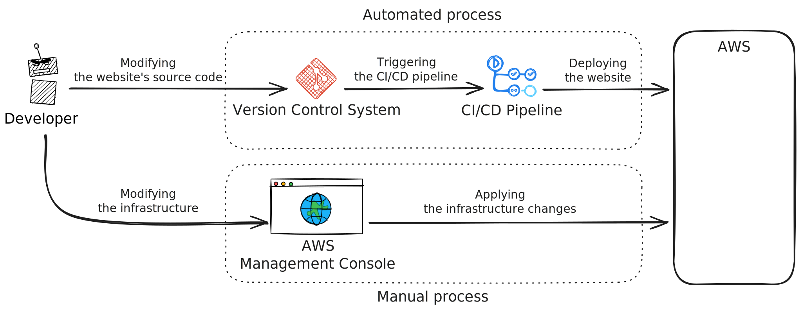
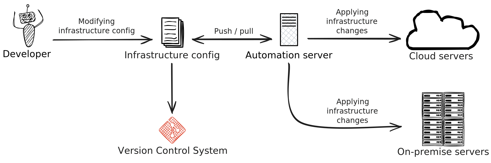
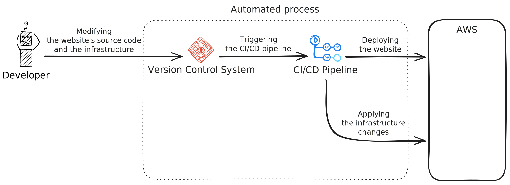
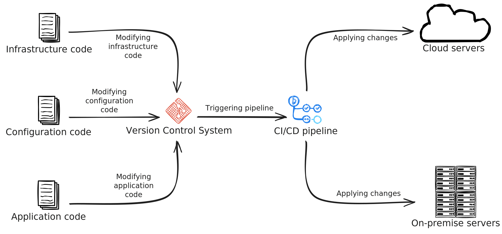
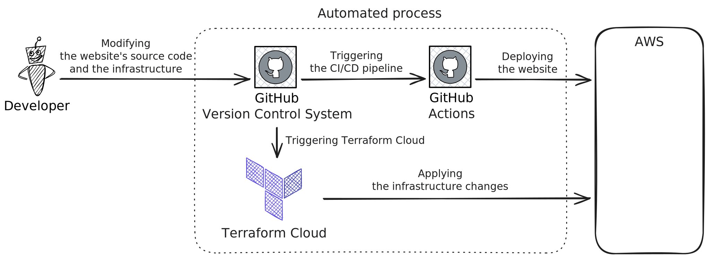

import BlogPostPicture from '@components/picture/BlogPostPicture.astro';

In this blog post we will discover the concept of _Infrastructure as Code (IaC)_, discussing its general principles and the various tools available for it. Additionally, we'll explore what it means to apply _IaC_ specifically in the context of managing the infrastructure for a static website on AWS with Terraform, highlighting the benefits and practical implications.

## What do we have?

We have a production-ready, secure, scalable, highly available, performant, and cost-effective static website hosted on AWS.

As showed in the previous posts, building the infrastructure for a static website is a straightforward process when following the step-by-step guide:

- [Hosting a static website on Amazon S3](/blog/hosting-a-static-website-on-amazon-s3)
- [Advanced static website hosting with Amazon S3 and CloudFront](/blog/advanced-static-website-hosting-with-amazon-s3-and-cloudfront)
- [URL redirect with Amazon CloudFront and Amazon Route 53](/blog/url-redirect-with-amazon-cloudfront-and-amazon-route-53)

### Development workflow

The current development workflow is designed to be straightforward and efficient, with the emphasis on automation.

However as you see on the diagram one part of the development workflow is still manual, and that is where we modify the infrastructure.

Let's dive a bit deeper into the current workflow.

#### Making changes to the website's source code

- **Modify the website's source code**: We make changes to the website's source code locally, such as adding new features, updating content, or fixing bugs.
- **Push changes to the repository**: Once the changes are done, they are pushed to the source code repository.
- **Automated CI/CD pipeline**: After the code is pushed, the CI/CD pipeline is automatically triggered. The pipeline handles the following steps:
    - **Building the website**: The source code is compiled / processed, using a static site generator.
    - **Running tests**: Automated tests are executed to ensure that the website functions correctly and that new changes haven't introduced any bugs.
    - **Deploying to AWS**: If the tests pass, the website is deployed to AWS.

This workflow simplifies the development process, as it is automated, from testing to deployment. However, the main focus in this blog post is on infrastructure, so we won't delve too deep into the CI/CD pipeline or the intricacies of the development process for the website itself.

#### Making changes to the infrastructure

While the website deployment is automated, managing the infrastructure is still a manual process. Changes to the infrastructure, such as adjusting configurations, modifying network settings, or scaling resources, are handled via the AWS Management Console.

This means that when adjustments are needed someone must log in to the management console and manually make the required updates. This can be time-consuming and error prone, especially when dealing with large-scale or complex infrastructures.

## What can we improve?

Manually managing the infrastructure is not only time-consuming but can also be quite frustrating. Even for an experienced system administrator, making the necessary adjustments to the infrastructure can be a slow and tedious process.
If the site goes down, it can take a significant amount of time to get it back online. Given that the provisioning process is entirely manual, the risk of making mistakes - especially in high-pressure situations - is quite high.

So, how can we avoid these challenges, streamline our processes, and ultimately enjoy a more stress-free experience?

Fortunately, _infrastructure as code_ offers a solution.

## Infrastructure as Code

In this section, we explore what _Infrastructure as Code (IaC)_ is, the advantages of using it and the available tools for it.

### What is it?

_Infrastructure as Code_ is a way to manage and provision infrastructure through code and configuration files, rather than via traditional manual processes or user interfaces.

In other words, _IaC_ treats infrastructure (such as servers, networks, databases, etc) as a set of code that can be version-controlled, tested, and deployed in repeatable manner. This approach allows us to define and manage infrastructure typically in a declarative way, stating what we want and how the infrastructure should look like, rather than how to create it.

_IaC_ solutions provide a high-level abstraction over the underlying infrastructure, allowing us to focus on the desired state of the environment, rather than the technical details of provisioning and managing individual resources.

Let's explore the different approaches to _IaC_.

#### Imperative vs declarative approach

There are two different approaches to _IaC_: _declarative_ and _imperative_.

The _declarative_ approach describes the desired state of the infrastructure (what we want), including the required resources and their properties. A tool is used to configure the infrastructure to match the desired state. Additionally, the declarative approach maintains a record of the current state of infrastructure resources, making it easier to manage changes and teardowns.

In contrast, the _imperative_ approach specifies the precise commands necessary to achieve the desired state (how we want it). These commands must be executed in the correct order.

The most popular approach nowdays is the _declarative_. It is much easier to describe what we want rather than how we want to achieve it. An _IaC_ tool does the heavy lifting for us and knows how to achieve the desired state.

It worth noting that some _IaC_ tools use an imperative language to describe the desired state, but they still follow the declarative approach. For example Pulumi.

#### Mutable vs immutable infrastructure

When adopting _IaC_ a crucial choice to consider is whether to implement _mutable_ or _immutable_ infrastructure. This decision determines how changes to the infrastructure are executed and reflects different philosophies in infrastructure management.

_Mutable_ infrastructure refers to an infrastructure that can be altered even after its initial provisioning. This offers development teams the flexibility to make on-the-fly adjustments to the infrastructure as needed. However, this approach can lead to _configuration drift_ and inconsistencies between environments.

The _immutable_ approach states that once the infrastructure is provisioned, it cannot be directly modified. Instead, if any changes are required, a new infrastructure is created to replace the existing one. This may seem challenging, but with containerization and the cloud, this becomes feasible and practical.

### Benefits

_IaC_ offers several benefits for provisioning and managing infrastructure resources via code:

- **Consistency**: With _IaC_, we can ensure consistency across multiple environments (e.g., dev, test, prod) by using the same configurations. This reduces the risk of human error and drift between environments.
- **Automation**: By using _IaC_ solutions, the provisioning process can be automated, reducing the need for manual intervention and minimizing the risk of human error. This also means we can deploy our infrastructure in a repeatable and consistent way.
    - **Repeatability**: _IaC_ enables us to reproduce our infrastructure quickly and accurately whenever needed. This is particularly useful when setting up new environments or deploying changes to existing ones.
    - **Reduced downtime**: _IaC_ solutions can be designed to automatically roll back changes in case of failure, reducing the risk of downtime and ensuring minimal disruption to users.
    - **Simplified disaster recovery**: _IaC_ makes it easier to set up disaster recovery plans by reproducing entire environments quickly and accurately.
- **Version control**: _IaC_ solutions allow us to treat the infrastructure as code, which means we can version it just like we would with any source code.
    - **Collaboration**: By treating it as source code and versioning it, makes it easier for multiple teams or individuals to collaborate on infrastructure changes without stepping on each other's toes. This improves communication and reduces conflicts.
    - **Auditability**: All changes are tracked and version-controlled, making it easy to identify who made what change and when. This provides a clear audit trail and helps with compliance.
- **Cost optimization**: _IaC_ solutions can help to optimize the infrastructure related costs (especially when it comes to the cloud) by enabling an easier automatic scaling down or shutting down resources that are not in use.

### Target development workflow

Let's see how the target development workflow looks like after introducing _Infrastructure as Code_, adding automation to applying infrastructure changes.

#### Making changes to the website's source code

This workflow remains the same as before. It's automated and streamlined already.

#### Making changes to the infrastructure

By adopting _Infrastructure as Code_, we can now automate our infrastructure management.

Rather than manually adjusting the infrastructure through the AWS Management Console, we define its desired state using an _IaC_ tool's configuration files. These files specify the resources to be provisioned, their attributes, and how they interact with each other. Just like with source code, we modify these configuration files when changes are needed and then commit those changes to our version control system.

In this setup, whenever changes are pushed to the repository, the CI/CD pipeline is automatically triggered and applies the changes to the infrastructure.

This streamlined process is automated, consistent, fast, and repeatable, significantly reducing the likelihood of human errors and ensuring that the infrastructure remains up-to-date.

### Overview of the available IaC tools

Now that we have a target development workflow which intends to automate the infrastructure changes, let's explore the available tools for _IaC_ and see how they can help us achieve this goal.

Luckily a wide variety of tools are available, choosing the right one for our specific needs can be challenging. To help navigating this landscape, let's have an overview by categorizing some of the most popular tools and check their primary use cases.

They can typically be categorized based on several key criteria:

- **Infrastructure provisioning or configuration management**: _Infrastructure provisioning_ and _configuration management_ tools are both essential components of _IaC_ and automation in IT environments, but they serve different purposes and address different stages of the infrastructure lifecycle.
- **Cloud compatibility**: Determine whether the tool is _cloud-agnostic_, meaning it can work across multiple cloud providers, or _cloud-specific_, tailored to a particular cloud platform like AWS or Azure.
- **Configuration style**: Whether the tool follows a _declarative_ approach, where we define the desired end state and the tool figures out the steps to achieve it, or an _imperative_ approach, where we explicitly outline the steps needed to reach the desired state.
- **Language and syntax**: Whether the tool utilizes a general-purpose programming language (such as Python, Go, or TypeScript), allowing for more flexible and familiar coding practices, or if it relies on its own domain-specific language (DSL), designed specifically for defining infrastructure configurations.
- **Agent-based or agent-less**: Whether the tool requires an agent to be installed on the target systems to manage them, or if it can interact with the systems remotely without an agent.
- **Push or pull**: Whether the tool pushes the configuration to the target systems or the target systems pull the configuration from a central server.
- **Drift detection and remediation**: Whether the tool can detect and correct configuration drifts, ensuring that the actual state of the infrastructure matches the desired state.

In this blog post we only discuss in details the _infrastructure provisioning_ tools, however it worth to mention the _configuration management_ tools briefly.

#### Infrastructure provisioning tools

_Infrastructure provisioning_ tools are used to create and manage the foundational infrastructure - whether in the cloud or on-premises - by automating the provisioning of resources like virtual machines, networks, and storage. They focus on the initial setup, management and decommissioning of infrastructure resources.

##### Cloud-agnostic tools

- [**Terraform**](https://www.terraform.io/): A _cloud-agnostic_ tool that supports a wide range of providers, it uses its own declarative syntax (HCL) to define infrastructure as code, making it a top choice for multi-cloud environments.
  Related tools:
    - [**CDK for Terraform**](https://developer.hashicorp.com/terraform/cdktf): The CDK allows us to use a general-purpose programming language to define and provision the infrastructure.
    - [**OpenTofu**](https://opentofu.org/): It is a fork of Terraform that is open-source, community-driven, and managed by the Linux Foundation.
- [**Pulumi**](https://www.pulumi.com/): A _cloud-agnostic_ tool that allows us to define infrastructure using general-purpose programming languages. A good choice for multi-cloud environments.

##### Cloud-specific tools

- [**AWS CloudFormation**](https://aws.amazon.com/cloudformation/): If we're working exclusively within AWS, CloudFormation provides deep integration with all AWS services, using JSON or YAML templates to define (in a declarative way) and manage resources.
  Related tools:
    - [**AWS Cloud Development Kit**](https://aws.amazon.com/cdk/): The AWS CDK allows us to use a general-purpose programming language to define and provision infrastructure within AWS.
- [**Microsoft ARM Templates**](https://azure.microsoft.com/en-us/products/arm-templates): Azure Resource Manager templates are JSON files used to define (in a declarative way) the infrastructure and configuration within Azure.
  Related tools:
    - [**Microsoft Azure Bicep**](https://learn.microsoft.com/en-us/azure/azure-resource-manager/bicep/overview?tabs=bicep): Bicep is a domain-specific language (DSL) that uses declarative syntax to define the infrastructure and configuration within Azure.

#### Configuration management tools

_Configuration management_ tools take over after the infrastructure is provisioned, ensuring that the systems are properly configured, softwares are installed, and services are running as expected.

Popular configuration management tools:

- [Ansible](https://www.ansible.com/)
- [Puppet](https://www.puppet.com/)
- [Chef](https://www.chef.io/)
- [SaltStack](https://saltproject.io/)

### Choosing the right tool

As the complexity of managing modern infrastructure grows, so does the need for effective tools to streamline the process. _Infrastructure as Code_ has become a cornerstone of efficient, scalable, and reliable infrastructure management. However, with a wide variety of tools available, choosing the right one for our specific needs can be challenging.

We need to consider these factors when deciding:

- **Cloud provider**: Are we using AWS, Azure, Google Cloud, or a multi-cloud approach?
- **Scope**: Do we need to manage just cloud resources, or on-premises infrastructure as well?
- **Complexity**: How complex is our infrastructure? Do we need advanced features like modules or state management?
- **Ecosystem compatibility**: Choose a tool that integrates well with the existing tech stack or ecosystem.
- **Existing skills**: What programming languages are we comfortable with?
- **Learning curve**: Balance the tool's power with the time needed to become proficient.
- **Community and support**: A larger community often means better resources and third-party integrations.
- **Scalability**: Ensure the tool can grow with the needs and requirements.
- **Cost**: Some tools are free, others require licenses. We need to factor this into the decision.

## GitOps

_GitOps_ extends the principles of _Infrastructure as Code_ by integrating them into a Git-based workflow. It uses Git as the single source of truth for infrastructure and application configurations, enabling teams to manage infrastructure configurations, application code, and deployment processes in a unified way.

So we can safely say that without _GitOps_ there is no effective _Infrastructure as Code_. Therefore, it worth to mention it briefly.

### What is GitOps?

_GitOps_ is a methodology that applies Git-based workflows to infrastructure automation and application deployment. It ensures that the desired system state configuration is stored in a Git repository, and any changes to the system are made through pull requests (PRs). These changes are automatically applied to the system using CI/CD pipelines.

### Key principles

- **Declarative configuration**: The entire system configuration, including infrastructure and applications, is defined typically in a declarative way.
- **Versioned**: All configurations are stored in Git, providing a complete audit trail and version history.
- **Automation**: Changes merged into Git are automatically applied to the system using CI/CD pipelines.

### Benefits

- **Enhanced security**: All changes go through Git-based reviews, improving transparency and compliance.
- **Faster deployments**: Automated workflows reduce the time to deploy and roll back changes.
- **Improved collaboration**: Teams follow Git workflows, enabling better collaboration across development and operations.

### GitOps workflow

A typical _GitOps_ workflow follows these steps:

- A developer makes changes to the infrastructure or application configuration in Git.
- A pull request (PR) is created for review.
- Once approved, the changes are merged into the _main_ branch.
- A CI/CD pipeline detects the change and applies it, using a _IaC_ tool.

## Terraform

Now that the mandatory part is out of the way, we can focus on why Terraform was chosen to provision the infrastructure for my static website on AWS.

Terraform was briefly introduced above, but it worth to check it in more details.

### What is Terraform?

Terraform is an open-source _IaC_ tool, focusing on infrastructure provisioning, developed by HashiCorp. It allows users to define, provision, and manage infrastructure across various cloud providers and on-premises environments using a simple, declarative configuration language known as HashiCorp Configuration Language (HCL).

Key features:

- **Cloud-agnostic**: Terraform is designed to be _cloud-agnostic_, meaning it can manage infrastructure across multiple cloud providers (such as AWS, Azure) as well as on-premises environments (like VMware or OpenStack).
- **Declarative**: Terraform uses a _declarative_ approach to infrastructure management. Instead of specifying the step-by-step process to achieve a desired state, users define the desired state of their infrastructure, and Terraform determines how to achieve that state by creating, updating, or deleting resources as needed.
- **State management**: Terraform maintains a state file that keeps track of the current state of the infrastructure. This file allows Terraform to understand the differences between the desired state (as defined in the configuration files) and the actual state of the infrastructure. This enables Terraform to make incremental changes rather than recreating resources from scratch.
- **Execution plan**: Terraform provides an execution plan feature that shows what changes will be made to the infrastructure before they are actually applied. This allows users to review and approve the changes, reducing the risk of unintended modifications.
- **Modularity and reusability**: Terraform supports the creation of reusable modules, which are packages of Terraform configurations that can be shared and reused across different projects.
- **Provisioning and orchestration**: Terraform can provision a wide range of infrastructure resources, including virtual machines, networking components, storage, and more. Additionally, it can orchestrate the deployment of services and manage dependencies between resources, ensuring that they are created or updated in the correct order.

### Why it was chosen?

Terraform was chosen, because it is one of the most popular and versatile _IaC_ tool available today. It offers a range of features that make it well-suited for managing infrastructure across multiple cloud providers.

At the moment we are using only AWS to host our static website. However it is good to have the flexibility to switch to another cloud provider in the future,
or to manage on-premises infrastructure, without having to learn a new tool.

Terraform has a large community and extensive documentation, making it easy to find resources, examples, and solutions to common problems.

## Terraform Cloud

In order to effectively manage the infrastructure for our static website on AWS using Terraform, we need to manage and store the state file in a secure and centralized location. This is where Terraform Cloud comes into play. However there are other ways to manage the state file, like using an S3 bucket, but Terraform Cloud offers additional features that can be beneficial for teams and organizations.

### Why Terraform Cloud?

Using Terraform Cloud offers several benefits, particularly for teams and organizations looking to manage infrastructure in a scalable, collaborative, and automated manner. Here's why:

#### State management

- **Centralized state management**: Terraform Cloud securely stores state files, which track the current state of our infrastructure, in a centralized, but remote location. This prevents state file conflicts and ensures that all team members are working with the most up-to-date infrastructure state.
- **Versioned state files**: Previous state files are versioned, so we can roll back to earlier configurations if needed, reducing the risk of outages due to errors when updating the infrastructure.

#### Automation of infrastructure changes

Terraform Cloud can automatically plan and apply infrastructure changes by integrating with CI/CD pipelines. It ensures that the infrastructure is provisioned or updated automatically when new code is commited or pushed.

#### Collaboration and teamwork

Terraform Cloud provides a collaborative platform for teams to work on infrastructure changes together:

- **Workspaces**: Multiple team members can work on infrastructure changes in dedicated workspaces, preventing conflicts and ensuring that each change is properly reviewed and managed.
- **Version control system (VCS) integration**: Integrates seamlessly with GitHub, GitLab, Bitbucket, and other VCS platforms, automatically triggering Terraform runs when infrastructure code is committed or pushed.
- **Permissions**: We can define fine-grained access controls for different team members, ensuring that only the authorized individuals can make changes to production infrastructure, for example.
- **Secret management**: Terraform Cloud can securely manage sensitive data such as API keys, credentials, and other secrets, making it safer than hard-coding sensitive information in configuration files.

#### Cost efficiency and monitoring

- **Cost estimation**: Before applying changes, Terraform Cloud can provide an estimate of how much the infrastructure changes will cost. This can be useful to stay within budget and avoid unexpected expenses.
- **Audit trails and logging**: Terraform Cloud logs every action taken in the platform, making it easy to track changes, monitor activity, and maintain an audit trail for compliance purposes.

#### Policy as Code

Terraform Cloud includes [HashiCorp's Sentinel](https://www.hashicorp.com/sentinel), a policy-as-code framework that lets organizations enforce rules for their infrastructure. These policies can ensure that the infrastructure adheres, for example, to security or cost requirements before any changes are applied. So in this way we can prevent costly mistakes or security breaches.

#### Free and paid plans

Terraform Cloud offers both free and paid plans, making it accessible to small teams while also providing enterprise-level features like governance, collaboration, and security for larger organizations.

## Improved development workflow

Let's check how the target development workflow implementation looks like for this website after introducing _IaC_, Terraform, using Terraform Cloud and adding automation to applying the infrastructure changes.

### Making changes to the website's source code

This workflow remains the same as before. It's automated and streamlined already.

### Making changes to the infrastructure

By adopting _IaC_ with Terraform and Terraform Cloud, we can now automate our infrastructure management.

Rather than manually adjusting the infrastructure through the AWS Management Console, we define its desired state using Terraform configuration files. These files specify the resources to be provisioned, their attributes, and how they interact with each other. Just like with source code, we modify the Terraform files when changes are needed and then commit those changes to our version control system.

In our setup, whenever changes are pushed to the repository, Terraform Cloud automatically detects them. It then pulls the latest code, generates a plan for the proposed changes, and applies them to the infrastructure. This streamlined process is automated, consistent, fast, and repeatable, significantly reducing the likelihood of human errors and ensuring the infrastructure remains up-to-date.

## Conclusion

In this blog post, we went through the concept of _Infrastructure as Code (IaC)_ and discussed its benefits and the available tools for managing infrastructure via code.

Moreover, we've explored how integrating Terraform and Terraform Cloud into our development workflow can significantly enhance our infrastructure management.

Introducing _IaC_ to our development workflow is not for free, it requires time and effort to learn and implement it. However, the benefits of adopting _IaC_ can be substantial, especially as our infrastructure grows in complexity and scale.

As we continue to evolve our infrastructure practices, we can look into further improvements such as reusable modules, policy as code, and better secrets management to enhance security and maintainability.

## Additional resources

- Infrastructure as Code
    - [InfrastructureAsCode](https://martinfowler.com/bliki/InfrastructureAsCode.html)
    - [What is Infrastructure as Code with Terraform?](https://developer.hashicorp.com/terraform/tutorials/aws-get-started/infrastructure-as-code)
    - [What is Mutable vs. Immutable Infrastructure?](https://www.hashicorp.com/resources/what-is-mutable-vs-immutable-infrastructure)
    - [Infrastructure as code](https://docs.aws.amazon.com/whitepapers/latest/introduction-devops-aws/infrastructure-as-code.html)
    - [What is Infrastructure as Code (IaC)?](https://www.redhat.com/en/topics/automation/what-is-infrastructure-as-code-iac)
    - [Infrastructure as code](https://www.atlassian.com/microservices/cloud-computing/infrastructure-as-code)
- GitOps
    - [What is GitOps?](https://www.redhat.com/en/topics/devops/what-is-gitops)
    - [Is GitOps the next big thing in DevOps?](https://www.atlassian.com/git/tutorials/gitops)
- Terraform
    - [HashiCorp Terraform Adoption Stages](https://www.youtube.com/watch?v=FWpCQar9dYg)
    - [Keeping Terraform Cloud/Enterprise Provider Credentials Secure](https://medium.com/hashicorp-engineering/keeping-terraform-cloud-enterprise-provider-credentials-secure-2edfbd1dfb98)
    - [Enforcing AWS S3 Security Best Practices Using Terraform & Sentinel](https://medium.com/hashicorp-engineering/enforcing-aws-s3-security-best-practice-using-terraform-sentinel-ddcd181ff4b7)
    - [The Core Terraform Workflow](https://developer.hashicorp.com/terraform/intro/core-workflow)
    - [Phases of Terraform Adoption](https://developer.hashicorp.com/terraform/intro/phases)
